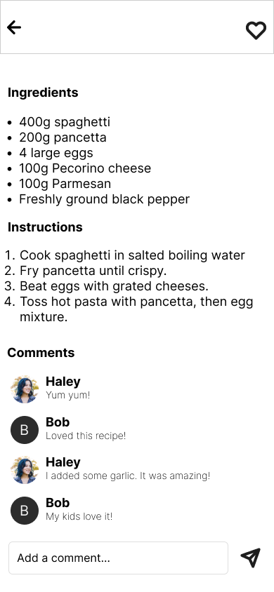

# App Chia Sẻ Công Thức Nấu Ăn

## Mô tả
Ứng dụng Chia Sẻ Công Thức Nấu Ăn là một nền tảng giúp người dùng khám phá, tạo và chia sẻ các công thức nấu ăn. Giao diện được thiết kế nhằm mang lại trải nghiệm trực quan và dễ sử dụng, tập trung vào sự tiện lợi và thẩm mỹ.

## Giao diện Figma
Dưới đây là các màn hình giao diện chính của ứng dụng, được thiết kế bằng Figma. Các hình ảnh minh họa cho từng trang sẽ giúp bạn có cái nhìn tổng quan về thiết kế và chức năng của ứng dụng.

### 1. **Trang chủ (Home)**
- Màn hình chính với danh sách các công thức nấu ăn nổi bật.
  

### 2. **Trang khám phá (Explore)**
- Người dùng có thể khám phá các công thức mới và xu hướng.
  

### 3. **Trang tìm kiếm (Search)**
- Tìm kiếm nhanh các công thức nấu ăn theo nguyên liệu hoặc tên món.

### 4. **Trang dấu trang (Bookmarks)**
- Lưu trữ và quản lý các công thức yêu thích của bạn.

### 5. **Trang chi tiết công thức (Recipe Detail)**
- Hiển thị chi tiết về từng công thức nấu ăn, bao gồm nguyên liệu và cách làm.

### 6. **Trang tạo công thức (Create Recipe)**
- Người dùng có thể dễ dàng thêm và chia sẻ công thức của riêng mình.

### 7. **Trang chat (Chat)**
- Tương tác và trao đổi kinh nghiệm nấu ăn với cộng đồng.

### 8. **Trang cá nhân (Profile)**
- Quản lý hồ sơ cá nhân và công thức đã tạo.

### 9. **Trang cài đặt (Settings)**
- Cấu hình và tùy chỉnh các thiết lập cá nhân.

### 10. **Trang đăng ký và đăng nhập (Register & Sign In)**
- Tham gia cộng đồng chia sẻ công thức nấu ăn với các bước đăng ký đơn giản.

### 11. **Bottom Sheet Dialog**
- Giao diện để thực hiện các hành động nhanh như thêm công thức vào bộ sưu tập hoặc chia sẻ.

---

## Cách sử dụng
- Tải xuống hình ảnh thiết kế Figma trong thư mục `figma_images` để xem chi tiết hơn về giao diện.
- Bạn cũng có thể truy cập vào [Figma project link](https://www.figma.com/design/2zWJOoVZNCHZSAik0NCM4k/App-chia-s%E1%BA%BD-c%C3%B4ng-th%E1%BB%A9c-n%E1%BA%A5u-%C4%83n?node-id=0-1) để xem trực tiếp với các mẫu thiết kế.
